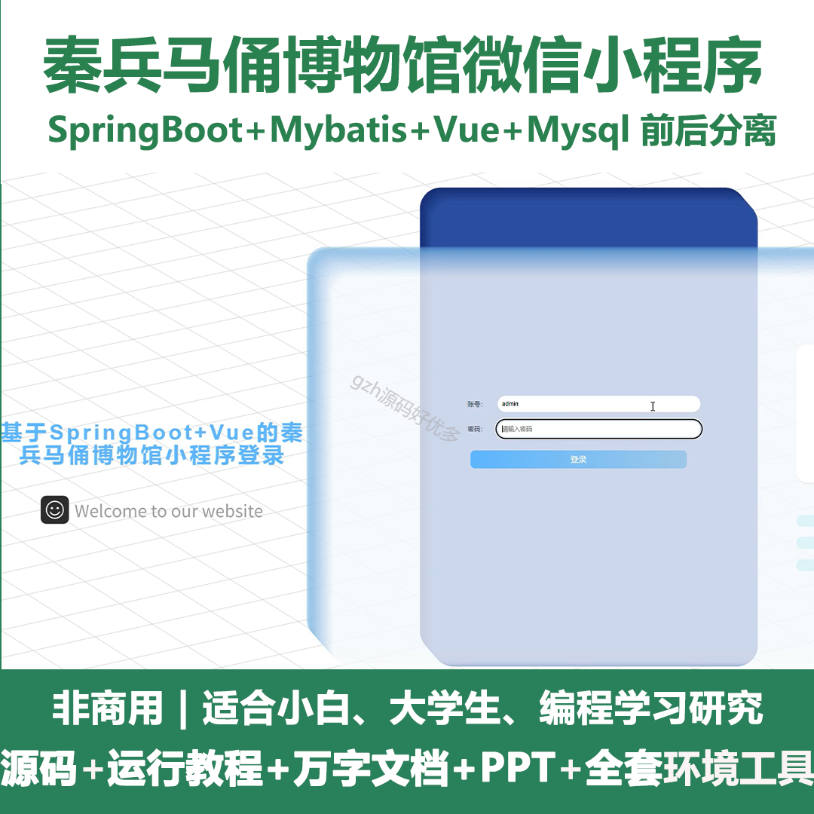
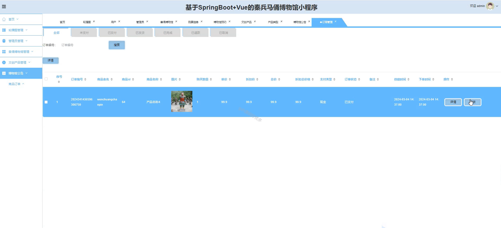

# mpweixinA066
mpweixinA066秦兵马俑博物馆微信小程序（Vue3+原生+unipp）
 
## 查看主页获取源码

### 一、作品包含

源码+数据库+全套环境和工具资源+部署教程

### 二、项目技术

前端技术：Html、Css、Js、Vue3.0、Element-ui、Uniapp

数据库：MySQL

后端技术：Java、Spring Boot、MyBatis

  

### 三、运行环境

开发工具：IDEA/eclipse + HBuilderX + 微信开发者工具

数据库：MySQL5.7（最低要5.7版本）

数据库管理工具：Navicat10以上版本

环境配置软件： JDK1.8+Maven3.6.3

前端Nodejs：16

### 四、项目介绍
项目编号：mpweixinA066

秦兵马俑博物馆小程序是一款集文化展示、导览服务、互动体验于一体的创新应用。
通过这个小程序，用户可以在线欣赏秦兵马俑的壮丽景象，了解每一件文物的历史背景和文化价值。同时，小程序还提供了实时导览功能，帮助游客在博物馆内更好地游览。无论是历史爱好者还是普通游客，都能在这个小程序中获得丰富的体验和知识。

### 五、运行截图

  
